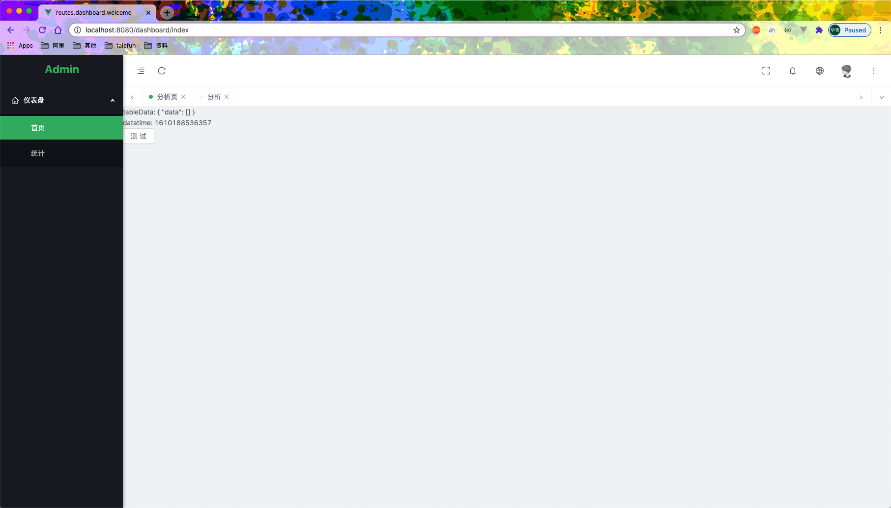
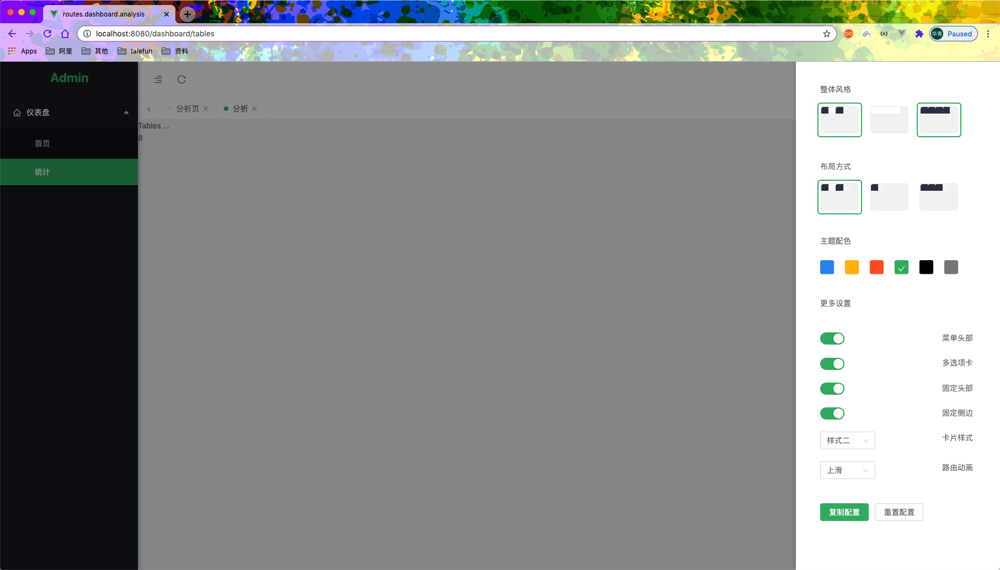
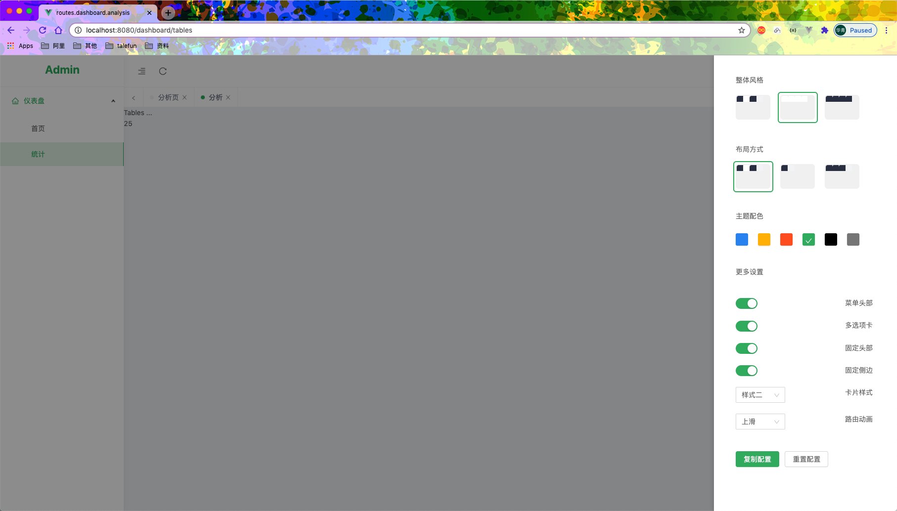
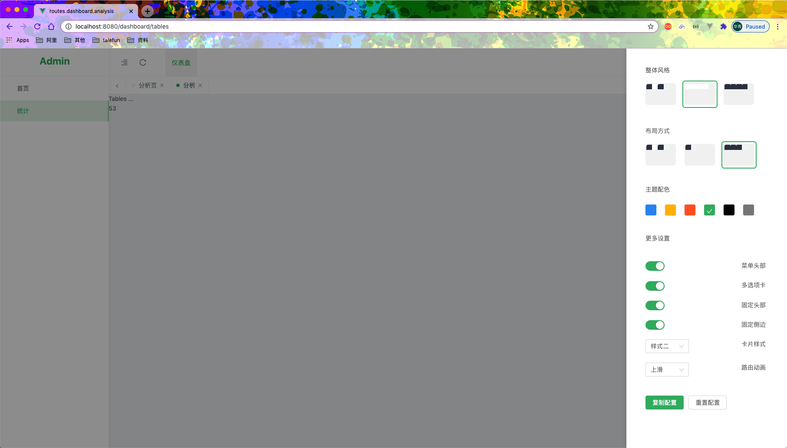
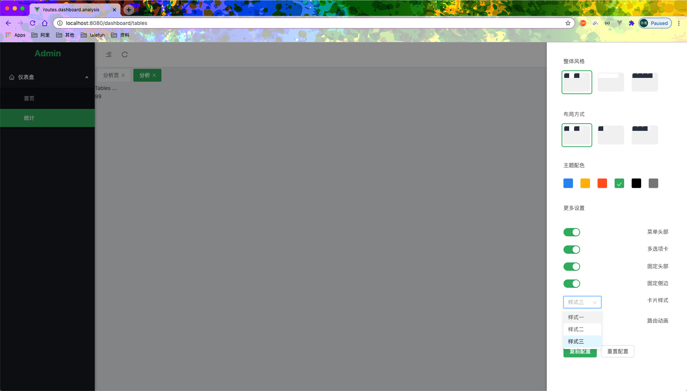
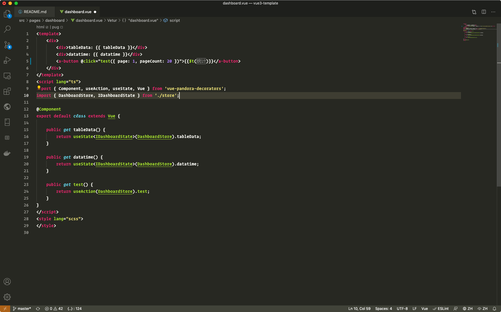
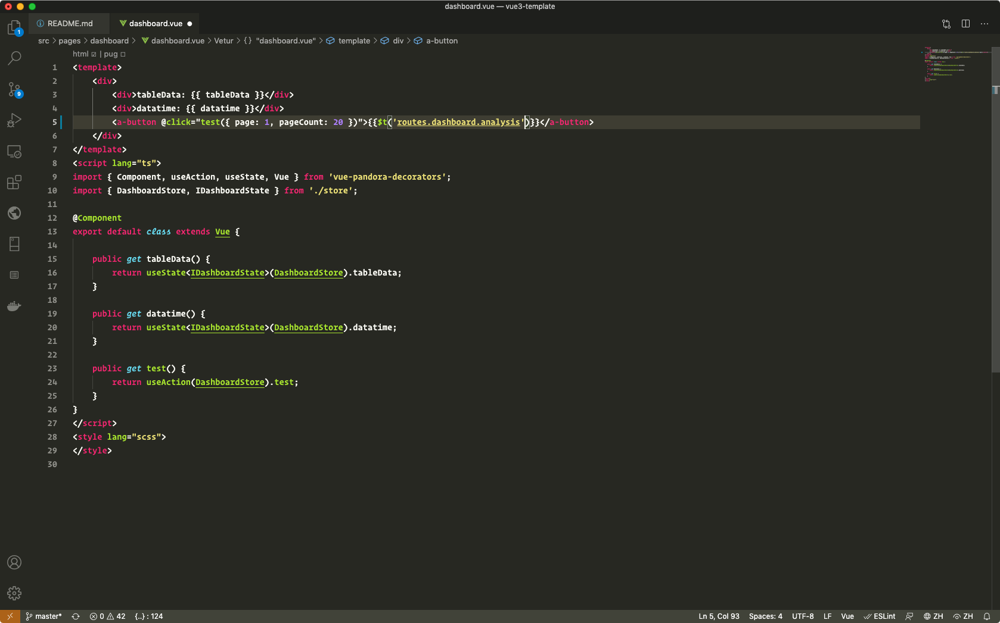

# Vue 3.0 Template
## 开始前先感谢一下 [Pear Admin](http://www.pearadmin.com/) 大部分布局照搬 😁  如果可以请顺手给 Pear Admin 点上一颗星

## 目录结构
```reStructuredText
.
├── LICENSE
├── README.md
├── babel.config.js													// babel 配置
├── package-lock.json
├── package.json
├── public																	// 静态文件
│   ├── favicon.ico
│   ├── img
│   ├── index.html
│   ├── robots.txt
│   └── theme.less
├── src																			// 源码目录
│   ├── assets															// 资源目录
│   │   ├── css
│   │   │   ├── animate.less
│   │   │   ├── common.less
│   │   │   ├── index.less
│   │   │   ├── layout.less
│   │   │   ├── night.less
│   │   │   └── tabs.less
│   │   └── image
│   │       ├── background.svg
│   │       └── logo.png
│   ├── components													// 全局 components
│   │   ├── cardBase												// card 组件 与 兼容主题设置
│   │   │   └── index.vue
│   │   ├── count
│   │   │   └── index.vue
│   │   ├── factory													// 特殊渲染工厂
│   │   │   ├── async.component.tsx					// 异步 promise 组件渲染
│   │   │   ├── compvar.tsx									// template 变量组件渲染
│   │   │   └── index.ts
│   │   ├── index.ts
│   │   ├── pageFooter
│   │   │   └── index.vue
│   │   ├── pageHeader
│   │   │   └── index.vue
│   │   └── pageLayout
│   │       └── index.vue
│   ├── config															// 配置
│   │   ├── locale.ts												// 多语言配置
│   │   ├── request.ts											// axios http 请求配置
│   │   ├── theme.config.ts									// 主题配置
│   │   └── whitList.ts											// 路由 鉴权 白名单
│   ├── core																// vue 中间件 和 依赖 加载
│   │   ├── app.tsx													// 基础 dom provider 和 service-worker-update-popup
│   │   ├── index.ts												// 全量输出所有中间件
│   │   ├── middlewares
│   │   │   ├── imports
│   │   │   │   └── index.ts
│   │   │   ├── index.ts
│   │   │   ├── prototype										// 全局扩展
│   │   │   │   ├── i18n.ts
│   │   │   │   ├── index.ts
│   │   │   │   └── request.ts
│   │   │   └── use													// 中间件
│   │   │       ├── antd.ts
│   │   │       ├── components.ts
│   │   │       ├── i18n.ts
│   │   │       ├── index.ts
│   │   │       ├── router.ts
│   │   │       └── store.ts
│   │   └── styles.ts												// 样式
│   ├── impls																// request 公用接口 类似于 dao
│   │   ├── list.request.impl.ts
│   │   └── response.impl.ts
│   ├── interceptors												// 拦截器
│   │   ├── index.ts
│   │   ├── request.ts											// axios 拦截器
│   │   └── router													// router 拦截器 这里可以自定义扩展
│   │       ├── index.ts
│   │       ├── permission.ts								// 权限拦截
│   │       └── progress.ts
│   ├── layout															// 布局
│   │   ├── index.vue
│   │   ├── module
│   │   │   ├── content
│   │   │   │   └── index.vue
│   │   │   ├── header
│   │   │   │   └── index.vue
│   │   │   ├── logo
│   │   │   │   └── index.vue
│   │   │   ├── menu
│   │   │   │   ├── SubMenu.vue
│   │   │   │   └── index.vue
│   │   │   ├── setup
│   │   │   │   └── index.vue
│   │   │   └── tab
│   │   │       └── index.vue
│   │   └── router.ts												// 异步根路由
│   ├── locales															// 多语言包
│   │   ├── index.ts
│   │   ├── lang
│   │   │   ├── en
│   │   │   │   ├── index.ts
│   │   │   │   ├── layout.ts
│   │   │   │   └── routes.ts
│   │   │   ├── es
│   │   │   │   ├── index.ts
│   │   │   │   ├── layout.ts
│   │   │   │   └── routes.ts
│   │   │   ├── index.ts
│   │   │   ├── jp
│   │   │   │   ├── index.ts
│   │   │   │   ├── layout.ts
│   │   │   │   └── routes.ts
│   │   │   └── zh
│   │   │       ├── index.ts
│   │   │       ├── layout.ts
│   │   │       └── routes.ts
│   │   └── types.ts
│   ├── main.ts														// 项目入口
│   ├── pages															// 应用页面
│   │   ├── dashboard
│   │   │   ├── dashboard.vue
│   │   │   ├── service.ts								// api 层 数据格式化层 类似 service + dto 层
│   │   │   └── store.ts									// vuex 数据层 建议 根页面 建立 store 子页面 更具业务定
│   │   ├── login
│   │   │   └── login.vue
│   │   └── tables
│   │       └── tables.vue
│   ├── pwa
│   │   ├── components
│   │   │   └── ServiceWorkerUpdatePopup.vue
│   │   ├── register-service-worker.ts
│   │   └── service-worker.js
│   ├── router.ts													// 子路由 路由 更具 模块 及 目录结构注册 协定 > 配置
│   └── store															// 全局 store
│       ├── index.ts
│       ├── modules
│       │   ├── app.ts
│       │   ├── index.ts
│       │   ├── layout.ts
│       │   ├── permission.ts
│       │   └── user.ts
│       └── service												// 全局 service
│           └── permission.service.ts
├── tsconfig.json
├── types																	// 书扩展
│   ├── shims-tsx.d.ts
│   ├── shims-vue.d.ts
│   └── vue.d.ts
└── vue.config.js
```

### 截图预览
















### 基本使用

#### .vue

```vue
<template>
    <div>
        <div>tableData: {{ tableData }}</div>
        <div>datatime: {{ datatime }}</div>
        <a-button @click="test({ page: 1, pageCount: 20 })">{{$t('routes.dashboard.analysis')}}</a-button>
    </div>
</template>
<script lang="ts">
import { Component, useAction, useState, Vue } from 'vue-pandora-decorators';
import { DashboardStore, IDashboardState } from './store';

@Component
export default class extends Vue {

    public get tableData() {
        return useState<IDashboardState>(DashboardStore).tableData;
    }

    public get datatime() {
        return useState<IDashboardState>(DashboardStore).datatime;
    }

    public get test() {
        return useAction(DashboardStore).test;
    }
}
</script>
<style lang="scss">
</style>
```

#### vuex

```typescript
import { Module, VuexModule, Action, Mutation } from 'vue-pandora-decorators';
import store from '@/store';
import { DashboardResponse, DashboardService, DashboardTestRequset } from './service';

export interface IDashboardState {
    datatime: string;
    tableData: DashboardResponse;
}

@Module({ store })
export class DashboardStore extends VuexModule implements IDashboardState {

    public service: DashboardService;
    public datatime: string;
    public tableData: DashboardResponse;

    constructor(module: DashboardStore) {
        super(module);
        this.service = new DashboardService();
        this.datatime = String((new Date()).getTime());
        this.tableData = new DashboardResponse();
    }

    @Action({ commit: 'testSuccess' })
    public async test(data: DashboardTestRequset) {
        return await this.service.test(data);
    }

    @Mutation
    public async testSuccess(data: DashboardResponse) {
        this.tableData = data;
        this.datatime = String((new Date()).getTime());
    }
}
```

#### service api

```typescript
import { Service } from 'vue-pandora-decorators';
import { ResponseImpl } from '@/impls/response.impl';
import { ListRequsetImpl } from '@/impls/list.request.impl';

export interface TestDashboardData {
    username: string;
    password: string;
}

export class DashboardResponse extends ResponseImpl {
    public data: TestDashboardData[];
    constructor() {
        super();
        this.data = [];
    }
}

export interface DashboardTestRequset extends ListRequsetImpl { }

export class DashboardService extends Service {
    public async test(data: DashboardTestRequset): Promise<DashboardResponse> {
        // return this.http.get<DashboardTestRequset, DashboardResponse>('rts/consoleapi/init', { data });
        return { err: '', errno: 0, errmsg: '', data: [] };
    }
}

```

## 感谢 vuex-module-decorators

## 感谢 vue-class-component

## 感谢 axios

## 感谢 antd

